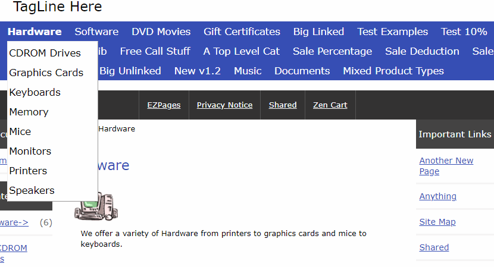

# Zen Cart - Category Tab Simple Dropdown Menu

Add subcategory dropdowns (one subcategory level or products) to the top category links of the Category Tab module.
See the readme.txt

Screenshot of result:

## Branch main
All code is in the template file.

## Branch module_template
Code is split between the module and template file as per core code.
